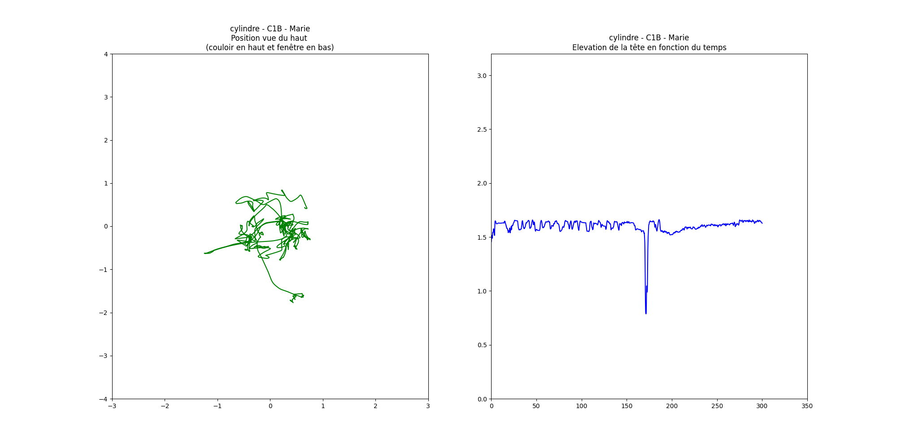

# Étude expérimentale : analyse des données

Dans le cadre d'une étude expérimentale pour l'Université de Technologie de Compiègne avec le laboratoire Costech et 
l'ENSADLab, nous avons fait passer une expérience en réalité virtiuelle à une dizaine de participant.
Les résultats sont analysés ici.

Se conférer au rapport et aux fichiers de données de démonstration dans le dossier *RESULTATS*.

## Objectifs et Expérience
À ce jour, l’essentiel des données est représenté aux utilisateurs dans un espace à deux dimensions : les smartphones, 
ordinateurs et tablettes ne sont que des plans sur lesquels sont disposées des images.
Pourtant, de plus en plus de solutions rendent le monde tri-dimensionnel transposable au digital, grâce notamment aux 
casques de réalité virtuelle.
Ainsi, il est intéressant d'observer comment les utilisateurs évoluent au sein de ces environnements immersifs : 
alors qu’ils ont l’habitude d’évoluer digitalement sur un plan, comment réagissent-ils à la tri-dimensionnalité 
numérique ? Retrouvent-ils leurs réflexes de la réalité ? Dans cette étude, le regard sera porté sur la visualisation 
de données à travers une question : comment l’espace tri-dimensionnel affecte la perception des utilisateurs dans  la 
visualisation d’images, à travers des tâches de recherche d’images ?

Pour tester ces hypothèses, un logiciel a été développé. Les participants ont été testés sur ce logiciel et ont répondu 
à un questionnaire subjectif. 
L’objectif est d’utiliser la réalité virtuelle pour effectuer de la recherche visuelle d'images. 
Pour cela, la condition en réalité virtuelle (trois dimensions) sera comparée à la condition en deux dimensions, dite 
“classique” car elle correspond à la recherche classique d’images sur un ordinateur. 
L'objectif pour les participants est valider (en cliquant sur un bouton) le plus d'images correspondantes à la catégorie
cible (comme "motos" ou "cannetons").

Les participants ont pu se déplacer, zoomer sur les images et les valider (conditions 2D et 3D). Ils ont disposé de cinq
minutes pour effectuer la tâche. Chaque participant est passé dans trois configuration :
- 3D avec affichage cylindrique
- 3D avec affichage sphérique (nuage d'images)
- 2D avec affichage en pages

## Analyse des données

L'ensemble des données disponibles (position, rotation, accélération, images validées, action, etc.) ont été enregistrées
toutes les 10 millisecondes.

Le but de l'analyse des donnéees est de déterminer **quelle configuration est la plus performante pour la recherche
d'images**. Les graphes sont réalisés avec matplotlib.

En premier lieu, le nombre d'images validées est l'un des indicateurs les plus pertinents.

En comparant d'autres facteurs, il est évident que la recherche d'images en 2D est la plus performatnte, sur une courte 
durée : l'ennui et le peu d'actions diminuera l'efficacité de la recherche pour un temps plus long.

D'autres données ont été analysées, comme 
- la position (3D puis 2D) :

- les rotations et leurs fréquences, le nombre d'images dans le champ de vision :

